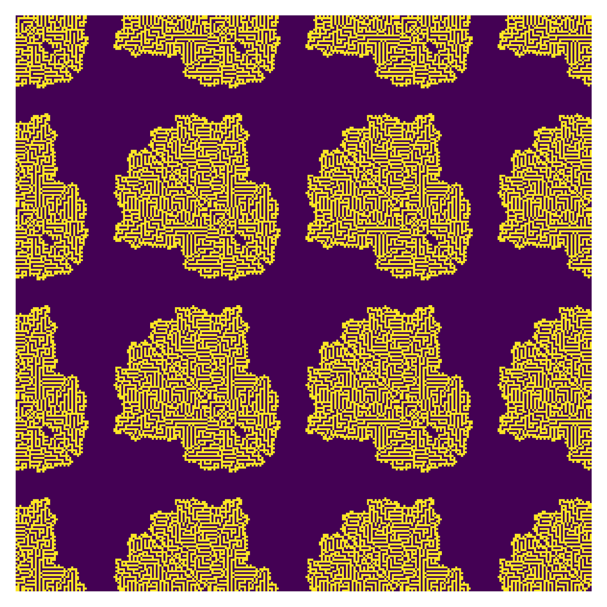

# GoLTGen

Custom Game of Life alike cellular automaton with a flexible and extended set of rules.

[production_web.webm](https://user-images.githubusercontent.com/7141239/230789976-2c1fab93-3d73-41d3-bd40-d1ee3da4c4eb.webm)

<table>
  <tbody>
    <tr>
      <td>
        
      </td>
      <td>
        
      </td>
    </tr>
    <tr>
      <td>
        
      </td>
      <td>
        
      </td>
      <td>
        
      </td>
    </tr>
  </tbody>
</table>

## Rules

A game consists of a playfield (gameSize) and its rules (gameRules). A rule consists of its name ("name"), a list of how many neighbors it takes to survive ("survive"), a list of how many neighbors it takes to be birthed ("birth") and optional a cells lifetime ("starve"). All ammounts of neighbours outside of "survive" and "birth" will mark a cell as dying. While "survive" and "birth" are borrowed game dynmaics borrowed from Game of Life, "starve" is rather foreign here. It is the time in steps it takes to starve a cell designated to die, set this to 0 if you don't want to use this.

## Inspiration

This concept is heavily insipred by [The Powder Toys](https://powdertoy.co.uk/Wiki/W/Element:LIFE.html) Life element. Please consider donating to them <3

The whole project was furthermore fueled by RevisionParty23 <3

## Usage

You can add your rules to the list of rules below, and choose one from the commandline.

NixOS `./generate.py <name>` or `./generate.py`

other `python3 generate.py <name>` or `python3 generate.py`
